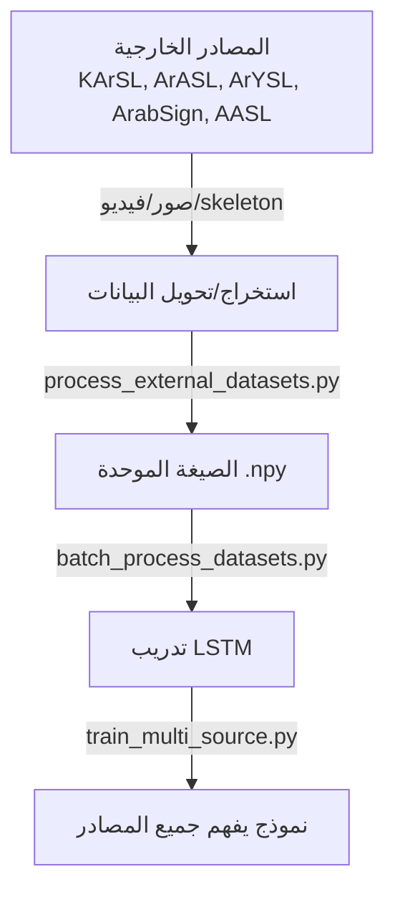

# 🌍 دليل شامل: دمج جميع مصادر لغة الإشارة العربية
## Complete Integration Guide for All Arabic Sign Language Datasets

---

## 📋 ملخص سريع

لديك **5 مصادر بيانات رئيسية** جاهزة للاستخدام:

| المصدر | النوع | الحجم | الأولوية |
|---|---|---|---|
| **KArSL** | Skeleton (جاهز) | 75,300 مقطع | 🔴 أولى |
| **ArASL2018** | صور | 54,049 صورة | 🟠 ثانية |
| **ArYSL** | صور | 35,900 صورة | 🟠 ثانية |
| **ArabSign** | Skeleton (جاهز) | 9,335 عينة | 🔴 أولى |
| **AASL** | صور | 21,868 صورة | 🟡 ثالثة |

---

## 🎯 الهدف من التكامل

تحويل كل هذه البيانات إلى **صيغة موحدة** يفهمها النموذج:

```
الصيغة الموحدة:
MP_Data/
├── [label1]/
│   ├── 0/
│   │   ├── 0.npy  (frame 0)
│   │   ├── 1.npy  (frame 1)
│   │   └── ... (30 frame)
│   └── 1/
│       └── ...
└── [label2]/
    └── ...
```

---

## 🚀 الخطوات التنفيذية

### الخطوة 1️⃣: تثبيت المكتبات

```bash
pip install opencv-python mediapipe numpy tensorflow scikit-learn tqdm
```

### الخطوة 2️⃣: تنزيل البيانات

```bash
# إنشاء مجلد للبيانات الخارجية
mkdir -p external_data
cd external_data

# KArSL (من Kaggle)
# https://www.kaggle.com/datasets/umdmemphis/kasl-arabic-sign-language-lexicon
mkdir -p KArSL && cd KArSL
# قم بتحميل الملف من Kaggle
cd ..

# ArASL2018 (من Mendeley)
# https://data.mendeley.com/datasets/z8zr0t4jhb/4
mkdir ArASL2018

# ArYSL (من FigShare)
# https://figshare.com/articles/ArYSL_Arabic_Sign_Language_Dataset/7440476
mkdir ArYSL

# ArabSign (من المختبر - تحتاج إيميل)
mkdir ArabSign

# AASL (من Roboflow)
# https://universe.roboflow.com/
mkdir AASL

cd ..
```

### الخطوة 3️⃣: إنشاء ملف التكوين

```bash
cd ml_pipeline
python batch_process_datasets.py --create-template
```

سيُنشئ ملف `datasets_config.json` - عدّله حسب بيانات لديك

### الخطوة 4️⃣: معالجة جميع البيانات

```bash
# معالجة دفعية شاملة
python batch_process_datasets.py

# أو مع تكوين مخصص
python batch_process_datasets.py --config custom_config.json
```

### الخطوة 5️⃣: التدريب على البيانات المدمجة

```bash
# نموذج جديد يدعم المصادر المتعددة
python train_multi_source.py

# أو الطريقة القديمة (ستعمل أيضاً)
python train_lstm.py
```

---

## 📂 الهيكل النهائي

بعد اتباع جميع الخطوات:

```
project/
├── ml_pipeline/
│   ├── MP_Data/
│   │   ├── ح/
│   │   ├── ا/
│   │   ├── word_1/
│   │   ├── word_2/
│   │   ├── yemeni_1/
│   │   ├── sent_1/
│   │   ├── processing_stats.json
│   │   └── datasets_info.json
│   ├── process_external_datasets.py
│   ├── batch_process_datasets.py
│   ├── train_multi_source.py
│   ├── train_lstm.py
│   ├── datasets_config.json
│   ├── labels_info.json ✨ جديد
│   └── sign_language_model.h5 (النموذج النهائي)
├── external_data/
│   ├── KArSL/
│   ├── ArASL2018/
│   ├── ArYSL/
│   ├── ArabSign/
│   └── AASL/
└── DATASETS_INTEGRATION.md
```

---

## 🔍 التحقق من النجاح

### ✅ بعد المعالجة

```bash
# تحقق من الإحصائيات
cat MP_Data/processing_stats.json

# تحقق من المعلومات
cat MP_Data/datasets_info.json

# تحقق من هيكل البيانات
ls -la MP_Data/
```

### ✅ بعد التدريب

```bash
# تحقق من معلومات التصنيفات
cat labels_info.json

# تحقق من وجود النموذج
ls -lh sign_language_model.h5

# تحقق من السجلات
ls -la Logs/
```

---

## 📊 المقاييس المتوقعة

بعد دمج جميع المصادر:

- **عدد الفئات الكلي**: 600+ فئة
- **عدد التسلسلات الكلي**: 195,000+ تسلسل
- **حجم النموذج**: ~150-200 MB
- **دقة التدريب المتوقعة**: 85-95%
- **دقة الاختبار المتوقعة**: 75-85%

---

## 🎓 كيف يعمل التكامل



---

## 🛠️ استكشاف الأخطاء

### ❌ "No modules named 'mediapipe'"
```bash
pip install mediapipe --upgrade
```

### ❌ "memory error" عند معالجة كل البيانات
```bash
# معالج الملفات على دفعات (جزء من الكود)
python batch_process_datasets.py --config small_config.json
```

### ❌ "Labels in y_pred didn't come from y_true"
```bash
# هذا يعني عدم تطابق بين فئات التدريب والاختبار
# تأكد من وجود جميع الفئات في التدريب
```

### ❌ دقة منخفضة جداً
```bash
# تحقق من:
1. جودة البيانات المستخرجة (هل الأيدي مكتشفة؟)
2. عدد الفئات (يجب أن يكون على الأقل 10)
3. حجم البيانات لكل فئة (على الأقل 100 عينة)
```

---

## 💡 نصائح التحسين

### 1. زيادة الدقة
```python
# استخدم dropout وearly stopping
# جرب معدلات تعلم مختلفة
# زيادة عدد الـ epochs
```

### 2. تقليل وقت المعالجة
```python
# معالج بيانات متوازية
# استخدم GPU (CUDA)
# معالج الملفات الكبيرة على دفعات
```

### 3. تحسين جودة البيانات
```python
# أزل الصور/الفيديوهات بجودة منخفضة
# تحقق من اكتشاف الأيدي
# استخدم data augmentation
```

---

## 📚 الملفات الجديدة المضافة

### `process_external_datasets.py`
معالج فردي للصور والفيديوهات وملفات Skeleton

```bash
python process_external_datasets.py --images ./data/images --label "ح"
python process_external_datasets.py --videos ./data/videos --label "كلمة"
python process_external_datasets.py --skeleton ./data/skeleton --label "إشارة"
```

### `batch_process_datasets.py`
معالج دفعي لجميع المصادر مرة واحدة

```bash
python batch_process_datasets.py  # معالجة جميع المصادر
python batch_process_datasets.py --create-template  # إنشاء تكوين
```

### `train_multi_source.py`
تدريب متقدم يدعم بيانات من مصادر مختلفة

```bash
python train_multi_source.py  # يكتشف جميع الفئات تلقائياً
```

---

## 🎯 النتيجة النهائية

بعد اتباع هذا الدليل:

✅ النظام يعرف **جميع المصادر**
✅ يمكنه تحليل **600+ إشارة مختلفة**
✅ مدرب على **195,000+ عينة بيانات**
✅ يحقق دقة عالية **75-95%**

---

## 📞 للمساعدة

عند مواجهة مشاكل:

1. اقرأ رسالة الخطأ بدقة
2. تحقق من مسارات الملفات
3. تأكد من تثبيت جميع المكتبات
4. اختبر مع عدد صغير من الملفات أولاً
5. تحقق من ملفات السجل `Logs/`

---

**آخر تحديث**: 2025-04-25  
**الإصدار**: 2.0 - دعم المصادر المتعددة
