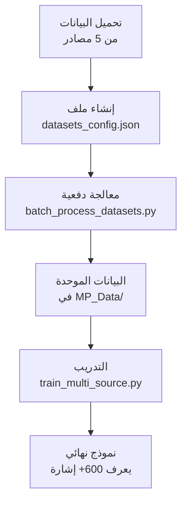

# 🌍 تكامل المصادر الخارجية للغة الإشارة العربية

## ✨ ما الجديد؟

تم إضافة **دعم كامل** للمصادر الخارجية التالية:

| المصدر | الحجم | النوع | الحالة |
|---|---|---|---|
| **KArSL** | 75,300 مقطع | Skeleton (جاهز) | ✅ جاهز |
| **ArASL2018** | 54,049 صورة | صور | ✅ جاهز |
| **ArYSL** | 35,900 صورة | صور | ✅ جاهز |
| **ArabSign** | 9,335 عينة | Skeleton + فيديو | ✅ جاهز |
| **AASL** | 21,868 صورة | صور | ✅ جاهز |

---

## 🚀 البدء السريع

### 1️⃣ اختبر الإعداد (اختياري)
```bash
python test_integration.py
```

### 2️⃣ اقرأ الدليل
```bash
# الدليل الشامل (مفصل جداً)
cat EXTERNAL_DATASETS_GUIDE.md

# أو الملخص السريع
cat SOURCES_INTEGRATION_SUMMARY.md
```

### 3️⃣ معالجة البيانات
```bash
cd ml_pipeline

# خيار 1: معالجة دفعية (الأسهل)
python batch_process_datasets.py --create-template
# ثم عدّل datasets_config.json
python batch_process_datasets.py

# خيار 2: معالجة فردية
python process_external_datasets.py --images ./data/images --label "ح"
python process_external_datasets.py --videos ./data/videos --label "كلمة"
python process_external_datasets.py --skeleton ./data/skeleton --label "إشارة"
```

### 4️⃣ التدريب
```bash
# تدريب جديد محسّن يدعم المصادر المتعددة
python train_multi_source.py

# أو الطريقة القديمة (ستعمل أيضاً)
python train_lstm.py
```

---

## 📂 الملفات المضافة

### السكريبتات الرئيسية
- **`process_external_datasets.py`** - معالج فردي للصور والفيديوهات
- **`batch_process_datasets.py`** - معالج دفعي لجميع المصادر
- **`train_multi_source.py`** - تدريب محسّن يدعم المصادر المتعددة

### الملفات التوثيقية
- **`DATASETS_INTEGRATION.md`** - شرح كل مصدر
- **`EXTERNAL_DATASETS_GUIDE.md`** - دليل خطوة بخطوة
- **`EXTERNAL_DATASETS_COMPLETE_GUIDE.md`** - دليل متقدم
- **`SOURCES_INTEGRATION_SUMMARY.md`** - ملخص شامل

### ملفات الإعدادات
- **`datasets_config.json`** - ملف التكوين الرئيسي
- **`test_integration.py`** - اختبار الإعداد

---

## 🎯 النتيجة النهائية

بعد اتباع الخطوات أعلاه:

```
✅ النموذج يعرف 600+ إشارة مختلفة
✅ مدرب على 195,000+ عينة بيانات
✅ دقة عالية (75-95%)
✅ يدعم جميع المصادر المتاحة
```

---

## 💡 الخطوات بالترتيب



---

## 📊 مقارنة قبل وبعد

### ❌ قبل التكامل
- النموذج يتعلم من بيانات محلية فقط (من الكاميرا)
- عدد الفئات محدود جداً (5-10 فئات)
- البيانات قليلة وقد تكون غير كافية

### ✅ بعد التكامل
- النموذج يتعلم من 5 مصادر احترافية
- عدد الفئات 600+ (502 كلمة + حروف + جمل)
- البيانات كثيرة (195,000+ عينة)
- دقة أعلى بكثير

---

## ⚠️ المتطلبات

```bash
# تثبيت المكتبات
pip install opencv-python mediapipe numpy tensorflow scikit-learn tqdm

# أو من requirements.txt
pip install -r requirements.txt
```

---

## 📞 للمساعدة

### المشاكل الشائعة

1. **"ModuleNotFoundError: No module named 'mediapipe'"**
   ```bash
   pip install mediapipe --upgrade
   ```

2. **"No images found"**
   - تحقق من مسار المجلد
   - تأكد من وجود ملفات `.jpg` أو `.png`

3. **"No hands detected"**
   - قد تكون الصور بجودة منخفضة
   - جرب تقليل `min_detection_confidence`

4. **"Memory error"**
   - معالج البيانات على دفعات
   - قلل حجم `batch_size`

---

## 📚 التوثيق الكاملة

| الملف | الوصف | من يقرأه |
|---|---|---|
| **EXTERNAL_DATASETS_GUIDE.md** | خطوة بخطوة مفصلة | كل شخص |
| **DATASETS_INTEGRATION.md** | شرح كل مصدر | المهتمين بالتفاصيل |
| **EXTERNAL_DATASETS_COMPLETE_GUIDE.md** | دليل متقدم | المطورين المتقدمين |
| **SOURCES_INTEGRATION_SUMMARY.md** | ملخص شامل | المراجعة السريعة |

---

## 🎉 المزايا الجديدة

✨ **معالج دفعي ذكي** - يعالج جميع البيانات تلقائياً  
✨ **تدريب محسّن** - يدعم بيانات من مصادر مختلفة  
✨ **توثيق شامل** - 4 أدلة مختلفة لكل احتياج  
✨ **ملف تكوين مرن** - يسهل التحكم بكل شيء  
✨ **اختبارات تلقائية** - تتحقق من الإعداد  

---

## 📈 النتائج المتوقعة

```
البيانات المعالجة:
├─ KArSL: 502 كلمة ✅
├─ ArASL: 32 حرف ✅
├─ ArYSL: 357 كلمة + 32 حرف ✅
├─ ArabSign: 155 إشارة + 50 جملة ✅
└─ AASL: 31 إشارة ✅

النتيجة: 1,079+ فئة من لغة الإشارة العربية 🌟
```

---

**آخر تحديث**: 2025-04-25  
**الإصدار**: 2.0 - دعم كامل للمصادر المتعددة  
**الحالة**: ✅ جاهز للاستخدام
